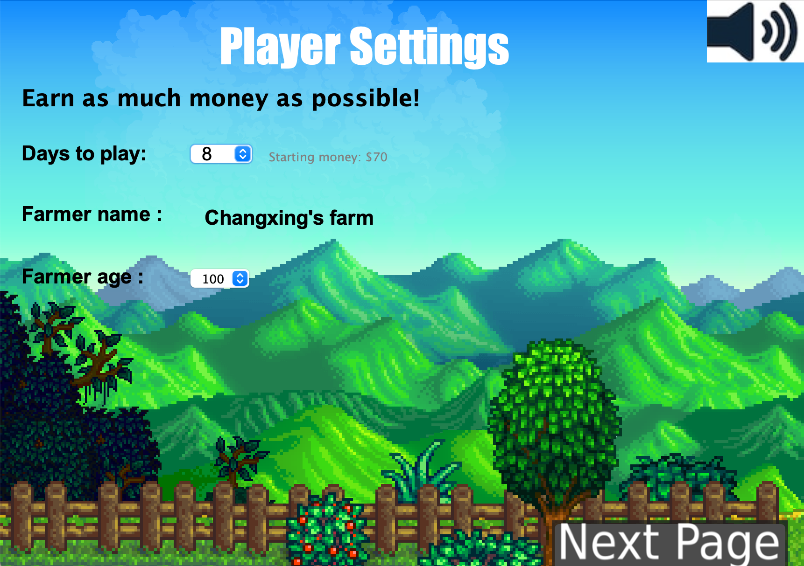
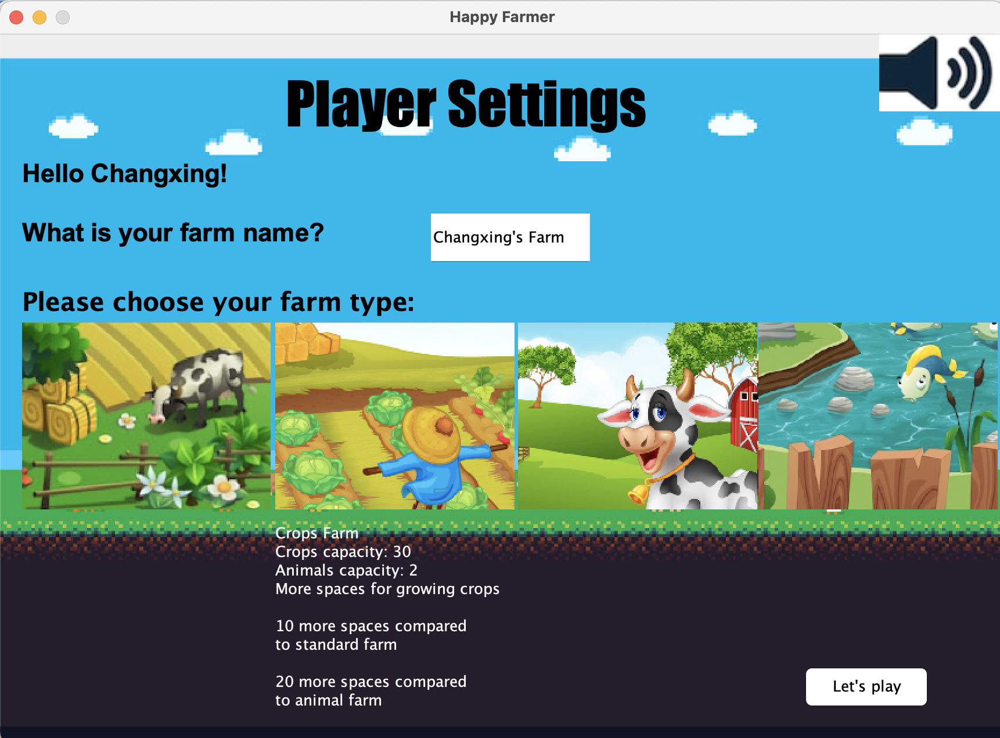
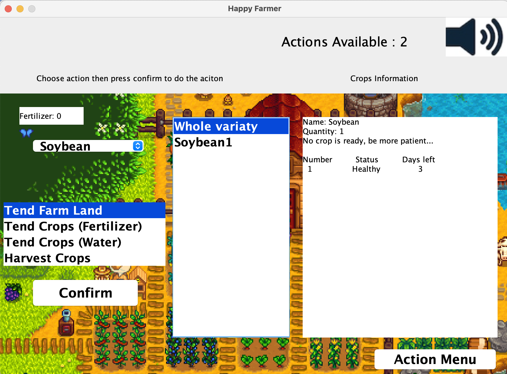
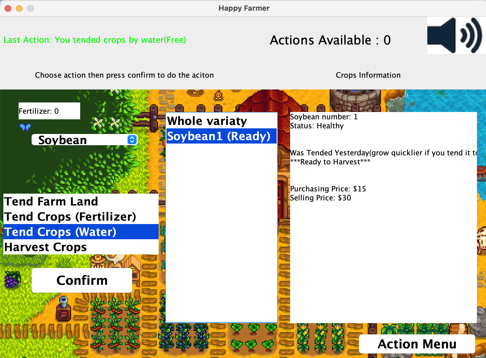

# Happy Farmer
Happy Farmer is a SENG201 Project at University of Canterbury. 

It's a farm simulator which allows you to play a simple farm game!
Please see "Game Introduction" below for more information.  

# Demo

# Prerequisites

* Prefer Java SE "12.0.1"  you can also use our lab machine.
   To download Java, please see: https://www.oracle.com/java/technologies/javase/jdk12-archive-downloads.html

* Install Eclipse IDE https://www.eclipse.org

# Getting Started
### _Runnable jar file_
Please make sure you have installed Java before running jar file.
To run it, simply use command line "java -jar .../HappyFarmer.jar".

### _Open project_
Eclipse -> File -> Open Projects from File System.. -> Import source(Root directory) -> finish

### _Run App.java_
Using Eclipse, Project Explorer: src -> main -> App.java

# Game Introduction
* The Goal of this game is earning as much money as you can given limited time!  
* A player has to find a balance point between his money and time. In the end, there would be a weighted final score considering all of the player's property.
The game can be achived and reloaded. 
* At the beginning, the player can choose days between 5-10, inclusive. The more starting days the player chooses, the less staring money the player has. Even though the player chooses 5 days at first, there is a "Time Machine" in general store, which allows the player having a chance to increase left time, but it's very expensive. 
* 4 types of farm: Standard, crop, animal, and fish farm. Each of them has its own special advantage and disadvantage, but all of them allows the player to grow crops and feed animals. 
* 6 species of crops and 3 species of animals are provided in general store. The player will only have starting money at the beginning. 
* 6 types of actions: Tend farm land, feed animals, harvest crops, tend crops by water or by fertilizer, play with animals and fishing(Fishing farm only). There are only 2 actions allowed to perform per day. 
* There will be some random events happening namely broken fence, drought and county fair encouraging and discouraging the player throughout the whole game when switching to the next day. Even though animals are relatively expensive, broken fence is very likely to happen due to poor management.  

# Enable GUI Design
**Please read this section carefully to open our design mode**

### _Install Window Builder_:
 Eclipse -> Help -> Eclipse Marketplace -> Window Builder 1.9.3

### _Setup Design_:
 Because all the classes under main.GUI package are using one shared Frame, Window builder is unable to switch design mode(except StartWindow.java).
  To resolve this, please insert one single line "mainFrame = new JFrame()" under line "======app mode====="  also comment out all the other constructors except the first one.	

# Example
Please see directory "example"

# Reference
All the pictures from web included in the project are only for demonstration purposes. 
Full reference list please see ExamplePictures.txt, their original authers reserve all rights.

# Author
Changxing Gong 
Rayhan Aristia

# Date
Project start time: 17/04/2020 
Project finish time: 24/05/2020
